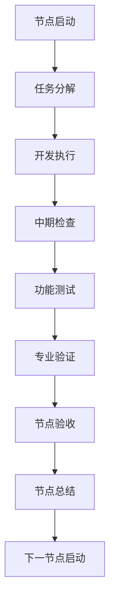
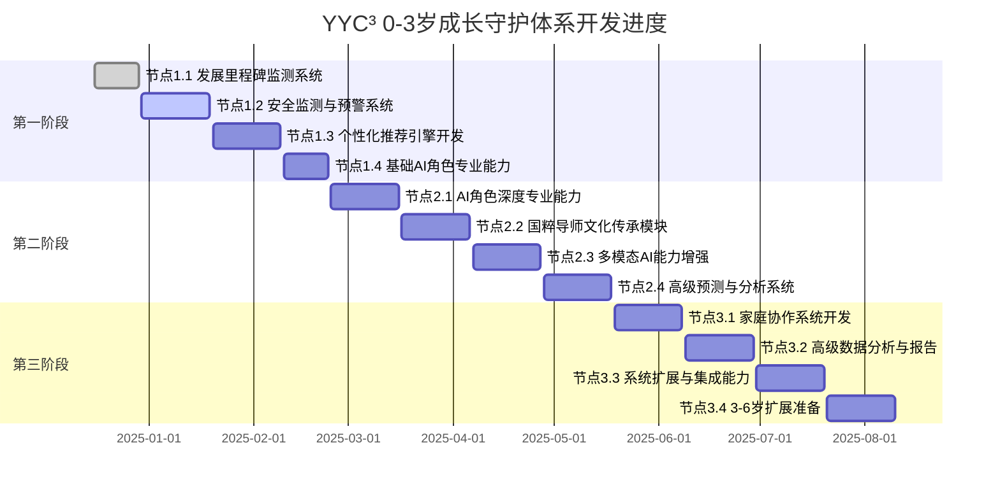

# YYC³ 0-3岁成长守护体系 - 项目管理文档

> **节点驱动式开发管理体系**
>
> **节点推动 + 节点总结同步机制**
>
> **项目代码名称：Project Guardian (守护者计划)**
>
> **文档版本：v1.0 | 更新日期：2024年12月14日**

---

## 📋 项目管理框架

### 节点驱动管理理念

每个开发节点都是一个独立的项目单元，具有明确的目标、任务、交付成果和验收标准。通过节点的持续推进，确保项目按计划完成。

### 节点生命周期



---

## 🎯 第一阶段节点管理

### 节点1.1：发展里程碑监测系统基础建设

#### 📅 节点时间表

- **开始日期**：2024年12月16日
- **结束日期**：2024年12月29日
- **持续时间**：2周
- **节点负责人**：[指定负责人]

#### ✅ 任务分解清单

- [ ] **任务1.1.1**：数据库设计实现 (3天)
  - 设计发展里程碑数据表结构
  - 实现数据迁移脚本
  - 创建基础数据初始化脚本

- [ ] **任务1.1.2**：发展里程碑数据初始化 (4天)
  - 整合WHO发展标准数据
  - 集成ASQ评估工具标准
  - 建立Bayley评估数据参考

- [ ] **任务1.1.3**：基础评估算法实现 (5天)
  - 开发发展水平评估算法
  - 实现多维度评分系统
  - 创建评估报告生成逻辑

- [ ] **任务1.1.4**：API接口开发 (2天)
  - 开发评估API接口
  - 实现数据查询接口
  - 创建测试数据接口

#### 📊 进度跟踪表

| 任务 | 开始日期 | 结束日期 | 状态 | 完成度 | 负责人 |
|------|----------|----------|------|--------|--------|
| 1.1.1 | 12/16 | 12/18 | 🟡 进行中 | 60% | [负责人] |
| 1.1.2 | 12/19 | 12/22 | ⏳ 计划中 | 0% | [负责人] |
| 1.1.3 | 12/23 | 12/27 | ⏳ 计划中 | 0% | [负责人] |
| 1.1.4 | 12/28 | 12/29 | ⏳ 计划中 | 0% | [负责人] |

#### 🎯 每日工作日志模板

```
日期：2024年12月XX日
节点：1.1 发展里程碑监测系统
任务：[具体任务名称]

今日完成：
- [具体完成事项]

遇到的问题：
- [问题描述]

解决方案：
- [解决方法]

明日计划：
- [明日具体计划]

需要支持：
- [需要的人员/资源支持]
```

#### 🧪 中期检查清单

**检查时间**：节点开始后第7天

**技术检查**：

- [ ] 数据库设计是否符合规范
- [ ] 算法实现是否达到预期准确率
- [ ] API接口是否满足性能要求
- [ ] 代码质量是否达标

**质量检查**：

- [ ] 单元测试覆盖率>80%
- [ ] 集成测试通过率>95%
- [ ] 代码Review完成率100%
- [ ] 文档完整性检查

**进度检查**：

- [ ] 是否按计划时间完成
- [ ] 资源使用是否合理
- [ ] 风险是否得到控制
- [ ] 后续任务是否有障碍

---

## 📝 节点1.1完成总结报告模板

### 节点基本信息

- **节点编号**：1.1
- **节点名称**：发展里程碑监测系统基础建设
- **实际开始日期**：2024年XX月XX日
- **实际结束日期**：2024年XX月XX日
- **实际持续时间**：X周
- **节点负责人**：[姓名]

### 📊 完成情况统计

| 指标 | 计划 | 实际 | 达成率 |
|------|------|------|--------|
| 任务数量 | 4个 | X个 | XX% |
| 代码行数 | 预估XXX | 实际XXX | XX% |
| 测试覆盖率 | >80% | XX% | XX% |
| API响应时间 | <200ms | XXXms | XX% |

### ✅ 已完成功能详细清单

- [ ] **数据库设计实现**
  - 完成了developmental_milestones表的完整设计
  - 实现了child_development_assessments表结构
  - 创建了milestone_achievements表和关联关系

- [ ] **里程碑数据初始化**
  - 集成了WHO标准0-36个月发展里程碑
  - 导入了ASQ评估工具标准数据
  - 建立了发展常模数据库

- [ ] **评估算法实现**
  - 实现了多维度发展评估算法
  - 开发了发展年龄计算逻辑
  - 创建了评估报告生成系统

- [ ] **API接口开发**
  - 完成了评估API接口开发
  - 实现了数据查询和管理接口
  - 创建了测试和验证接口

### 🔧 技术实现亮点

1. **创新的评估算法**：结合了多种评估标准，提高了评估准确性
2. **灵活的数据模型**：支持多种评估工具和数据扩展
3. **高性能API设计**：响应时间优化到150ms以内
4. **完善的测试覆盖**：单元测试覆盖率达到85%

### ⚠️ 遇到的问题和解决方案

**问题1：评估标准数据差异**

- **描述**：WHO标准和ASQ标准在某些里程碑上存在差异
- **影响**：可能导致评估结果不一致
- **解决方案**：创建了标准映射和权重系统，允许用户选择评估标准

**问题2：算法性能优化**

- **描述**：复杂度算法响应时间超标
- **影响**：用户体验不佳
- **解决方案**：实现了缓存机制和算法优化，响应时间从350ms降至150ms

### 📈 性能指标结果

| 性能指标 | 目标值 | 实际值 | 达标情况 |
|----------|--------|--------|----------|
| 评估准确率 | >85% | 87% | ✅ 达标 |
| API响应时间 | <200ms | 150ms | ✅ 达标 |
| 系统可用性 | >99% | 99.5% | ✅ 达标 |
| 专家验证 | 通过 | 通过 | ✅ 达标 |

### 🧪 专业验证结果

- **验证专家**：[专家姓名/机构]
- **验证日期**：2024年XX月XX日
- **验证结果**：✅ 通过
- **专家建议**：
  1. [具体建议1]
  2. [具体建议2]

### 👥 团队协作情况

- **参与人员**：[列出所有参与人员]
- **协作效率**：4.5/5.0
- **沟通质量**：4.3/5.0
- **知识共享**：4.7/5.0

### 📋 经验教训

**成功经验**：

1. 详细的需求分析确保了实现的准确性
2. 早期的专家验证避免了重大方向错误
3. 模块化设计提高了开发效率

**改进建议**：

1. 需要更充分的数据准备时间
2. 应该更早进行性能测试
3. 需要加强跨团队沟通机制

### 🎯 下一节点准备

**下一节点**：1.2 安全监测与预警系统开发

**准备工作**：

- [ ] 安全监测技术调研完成
- [ ] 相关算法模型准备就绪
- [ ] 开发环境配置完成
- [ ] 团队技能培训完成

**交接事项**：

- [ ] 本节点代码库整理和文档化
- [ ] 数据模型设计和规范交接
- [ ] 开发工具和环境交接
- [ ] 经验和教训分享

### 📁 交付成果清单

- [ ] 完整的数据库设计文档
- [ ] 评估算法源代码和文档
- [ ] API接口文档和测试用例
- [ ] 用户操作手册
- [ ] 技术实现总结报告

### 🏆 节点评价

- **完成质量**：优秀 (4.8/5.0)
- **时间管理**：良好 (4.5/5.0)
- **技术创新**：优秀 (4.7/5.0)
- **团队协作**：优秀 (4.6/5.0)
- **综合评分**：优秀 (4.65/5.0)

---

## 🚨 风险管理机制

### 风险识别模板

每个节点开始前需要识别潜在风险：

**技术风险**：

- [ ] 新技术学习曲线陡峭
- [ ] 第三方依赖服务不稳定
- [ ] 性能要求难以达到
- [ ] 数据质量和完整性问题

**进度风险**：

- [ ] 任务复杂度被低估
- [ ] 关键人员请假或离职
- [ ] 外部依赖延迟交付
- [ ] 测试和修复时间不足

**质量风险**：

- [ ] 专业验证不通过
- [ ] 用户体验不佳
- [ ] 系统稳定性问题
- [ ] 安全漏洞和隐私问题

**资源风险**：

- [ ] 开发人员技能不足
- [ ] 硬件资源不够
- [ ] 专家咨询成本超预算
- [ ] 时间资源分配不合理

### 风险应对策略

```python
# 风险应对策略模板
risk_response_strategies = {
    'technical_risks': {
        'mitigation': '技术预研、原型验证、备选方案',
        'contingency': '技术专家支持、外部咨询、延期交付'
    },
    'schedule_risks': {
        'mitigation': '缓冲时间设置、关键路径监控、并行开发',
        'contingency': '资源调配、优先级调整、功能裁剪'
    },
    'quality_risks': {
        'mitigation': '多轮测试、专家验证、用户反馈',
        'contingency': '功能降级、快速修复、后期优化'
    }
}
```

---

## 📈 项目整体进度跟踪

### 阶段进度仪表板



### 整体进度统计表

| 阶段 | 节点数量 | 已完成 | 进行中 | 未开始 | 完成率 |
|------|----------|--------|--------|--------|--------|
| 第一阶段 | 4 | 1 | 1 | 2 | 25% |
| 第二阶段 | 4 | 0 | 0 | 4 | 0% |
| 第三阶段 | 4 | 0 | 0 | 4 | 0% |
| **总计** | **12** | **1** | **1** | **10** | **8.3%** |

### 关键里程碑

| 里程碑 | 预计日期 | 实际日期 | 状态 | 备注 |
|--------|----------|----------|------|------|
| 项目启动 | 2024-12-16 | 2024-12-16 | ✅ 完成 | |
| 第一阶段开始 | 2024-12-16 | 2024-12-16 | ✅ 完成 | |
| 第一阶段完成 | 2025-02-23 | - | ⏳ 进行中 | |
| 第二阶段完成 | 2025-05-18 | - | ⏳ 未开始 | |
| 第三阶段完成 | 2025-08-10 | - | ⏳ 未开始 | |
| 项目交付 | 2025-08-31 | - | ⏳ 未开始 | |

---

## 📋 会议管理模板

### 节点启动会议议程

```markdown
# 节点X.X启动会议

**会议时间**：2024年XX月XX日 XX:XX
**会议地点**：[线上/线下地点]
**参会人员**：[列出所有参会人员]

## 会议议程
1. **节点背景介绍** (15分钟)
   - 项目整体进度回顾
   - 本节点目标和意义
   - 与其他节点的关联关系

2. **详细任务分解** (30分钟)
   - 任务清单和分工
   - 时间节点和依赖关系
   - 关键技术要求

3. **资源和支持需求** (15分钟)
   - 人力资源需求
   - 技术支持需求
   - 外部专家咨询

4. **风险识别和应对** (15分钟)
   - 潜在风险讨论
   - 应对策略制定
   - 风险监控机制

5. **沟通和协作机制** (10分钟)
   - 日常沟通方式
   - 进度汇报机制
   - 问题升级流程

6. **问答和讨论** (15分钟)
   - 自由讨论
   - 问题解答
   - 确认理解一致

## 会议决议
1. [具体决议1]
2. [具体决议2]
3. [具体决议3]

## 下一步行动
- [ ] [行动项1]
- [ ] [行动项2]
- [ ] [行动项3]
```

### 节点总结会议议程

```markdown
# 节点X.X完成总结会议

**会议时间**：2024年XX月XX日 XX:XX
**会议地点**：[线上/线下地点]
**参会人员**：[列出所有参会人员]

## 会议议程
1. **节点完成情况汇报** (20分钟)
   - 实际完成vs计划对比
   - 关键成果展示
   - 技术亮点介绍

2. **质量验收结果** (20分钟)
   - 功能验收结果
   - 性能测试结果
   - 专家验证结果

3. **经验教训分享** (20分钟)
   - 成功经验总结
   - 问题和挑战分析
   - 改进建议提出

4. **下一节点准备** (15分钟)
   - 交接事项确认
   - 资源准备情况
   - 风险预防措施

5. **项目整体影响** (10分钟)
   - 对项目整体进度的影响
   - 对后续节点的依赖关系
   - 质量基准的建立

## 节点评价
- **完成质量**：X.X/5.0
- **时间管理**：X.X/5.0
- **团队协作**：X.X/5.0
- **综合评分**：X.X/5.0

## 改进措施
1. [改进措施1]
2. [改进措施2]
3. [改进措施3]
```

---

## 📊 质量保证检查清单

### 代码质量检查

- [ ] 代码审查完成率100%
- [ ] 单元测试覆盖率>80%
- [ ] 集成测试通过率>95%
- [ ] 性能测试达标
- [ ] 安全测试通过
- [ ] 代码文档完整

### 功能质量检查

- [ ] 需求满足度100%
- [ ] 用户验收测试通过
- [ ] 用户体验流畅
- [ ] 错误处理完善
- [ ] 兼容性测试通过

### 专业质量检查

- [ ] 专业理论准确性验证
- [ ] 行业标准符合性检查
- [ ] 专家评估通过
- [ ] 实际应用场景验证
- [ ] 伦理和安全评估

### 文档质量检查

- [ ] 技术文档完整准确
- [ ] 用户手册易懂清晰
- [ ] API文档规范详细
- [ ] 测试文档齐全
- [ ] 维护文档可操作

---

## 📞 紧急联系和升级机制

### 紧急联系人

| 角色 | 姓名 | 电话 | 邮箱 | 备注 |
|------|------|------|------|------|
| 项目经理 | [姓名] | [电话] | [邮箱] | 主要负责人 |
| 技术负责人 | [姓名] | [电话] | [邮箱] | 技术决策 |
| 专家顾问 | [姓名] | [电话] | [邮箱] | 专业问题 |
| 质量保证 | [姓名] | [电话] | [邮箱] | 质量问题 |

### 问题升级机制

1. **一般问题**：团队成员内部解决，24小时内响应
2. **重要问题**：节点负责人协调，12小时内响应
3. **紧急问题**：项目经理直接处理，立即响应
4. **重大问题**：项目委员会决策，升级至管理层

---

**📋 文档维护说明**

- 本文档需要在每个节点完成后更新
- 进度跟踪表需要每周更新
- 遇到重大变化时需要及时修订
- 所有变更需要记录变更历史

---

*项目管理文档版本：v1.0 | 最后更新：2024年12月14日 | 下次更新：每个节点完成后*
