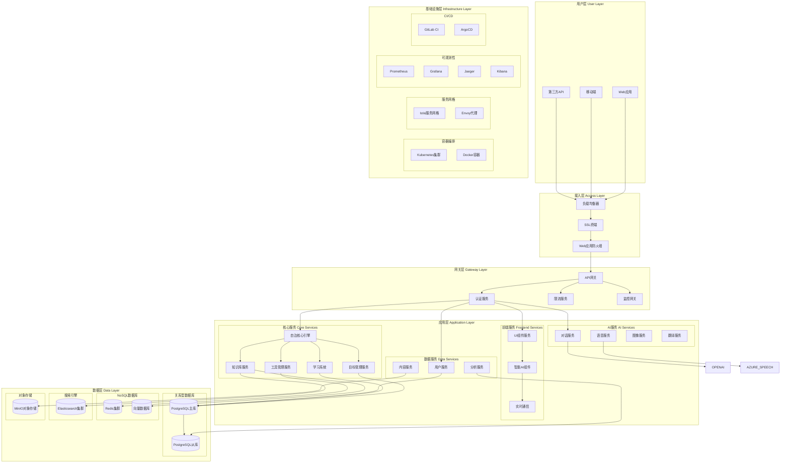
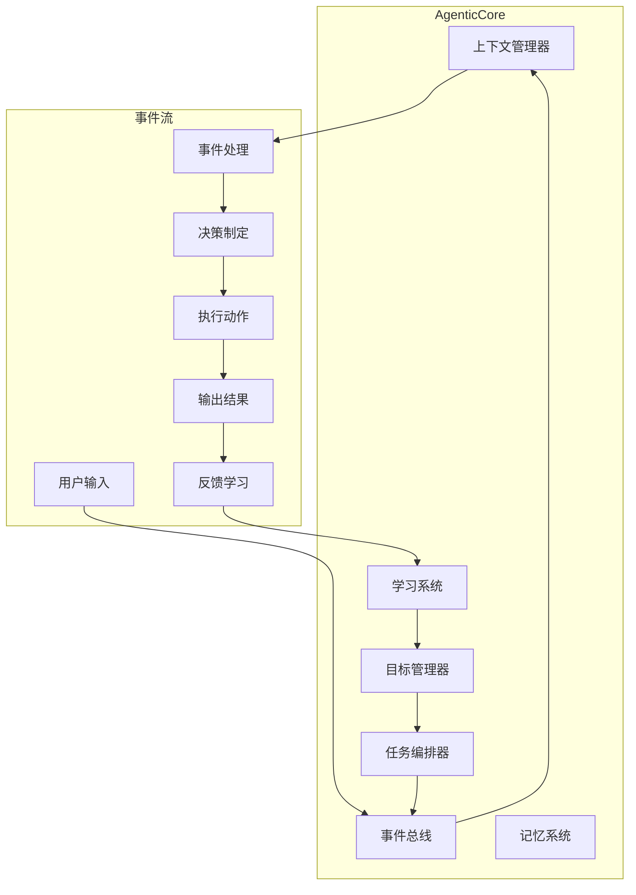
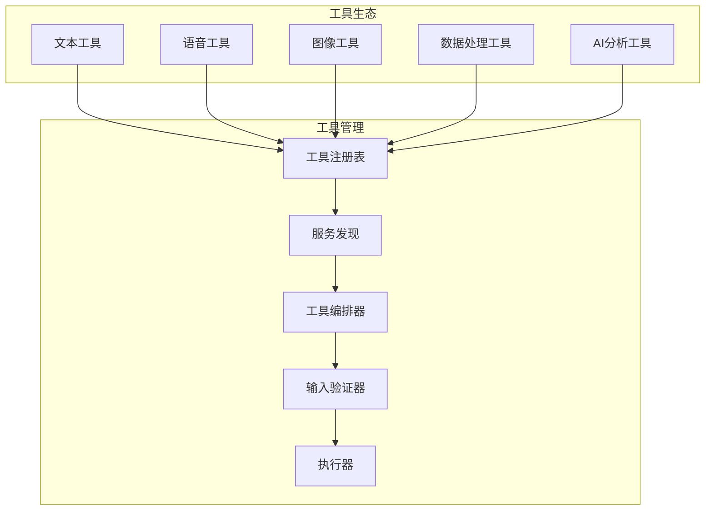
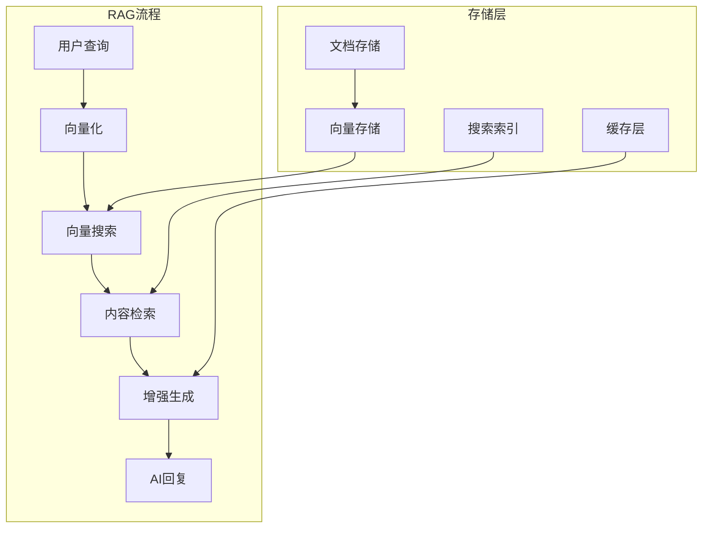
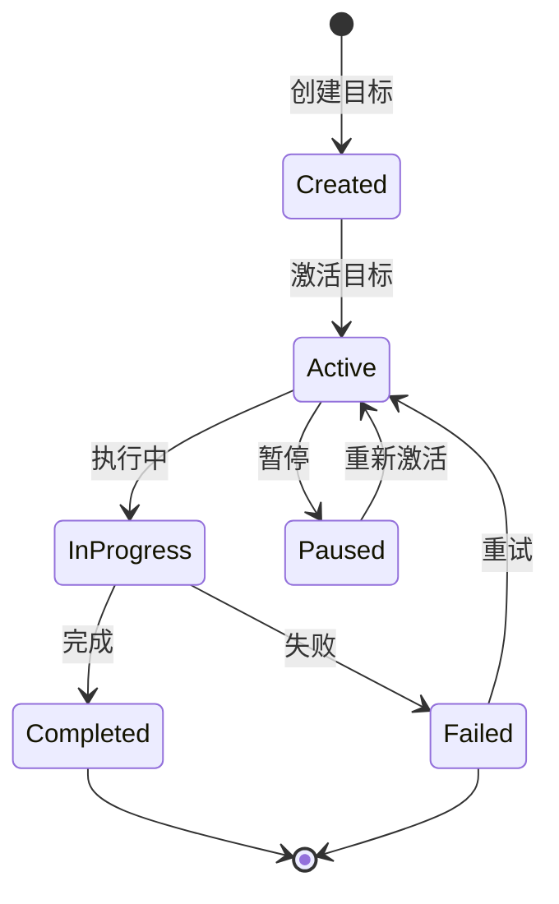
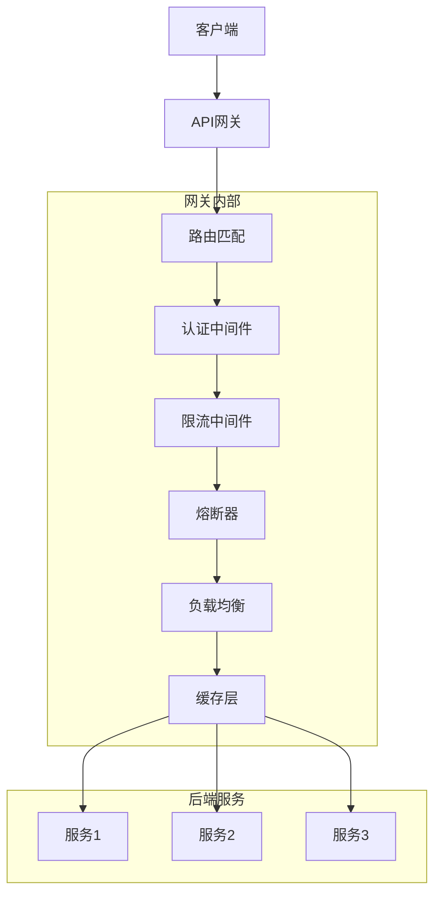
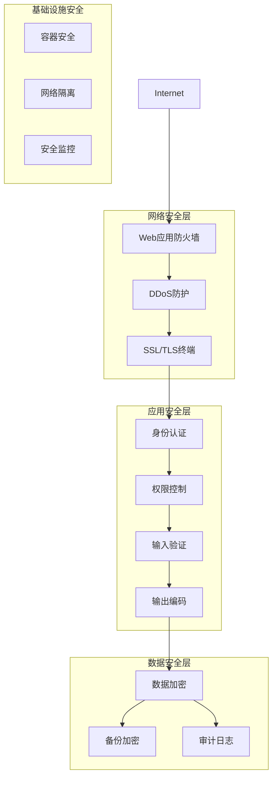

# YYC³ 智能插拔式移动AI系统 架构文档

## 📖 概述

YYC³智能插拔式移动AI系统是一个现代化的、可扩展的AI服务平台，采用微服务架构、事件驱动设计和容器化部署。本文档详细描述系统的整体架构、设计原则、技术选型和实现细节。

## 🏗️ 系统架构概览

### 核心设计理念

1. **微服务架构** - 服务解耦、独立部署、水平扩展
2. **事件驱动** - 异步通信、松耦合、高容错
3. **插件化设计** - 动态加载、热插拔、易扩展
4. **云原生** - 容器化、自动化运维、弹性伸缩
5. **AI优先** - 智能驱动、自适应学习、持续优化

### 整体架构图



## 🧠 核心组件架构

### 1. 自治核心引擎 (AgenticCore)

#### 架构设计



#### 核心接口

```typescript
// services/core/AgenticCore.ts
export interface IAgenticCore {
  // 初始化
  initialize(config: AgenticConfig): Promise<void>;

  // 事件处理
  emitEvent(event: IEvent): Promise<void>;
  onEvent(eventType: string, handler: EventHandler): void;

  // 目标管理
  createGoal(goal: GoalDefinition): Promise<Goal>;
  updateGoal(goalId: string, updates: Partial<Goal>): Promise<Goal>;
  achieveGoal(goalId: string): Promise<void>;

  // 任务执行
  executeTask(task: TaskDefinition): Promise<TaskResult>;

  // 学习和优化
  learn(experience: Experience): Promise<void>;
  adapt(context: Context): Promise<void>;
}
```

#### 实现特点

- **事件驱动架构**: 基于EventEmitter实现松耦合
- **目标驱动**: 用户目标指导系统行为
- **自适应学习**: 持续学习和优化
- **记忆系统**: 长短期记忆管理
- **并发处理**: 支持多任务并行执行

### 2. 工具管理系统

#### 架构 设计



#### 工具接口标准

```typescript
// services/tools/ITool.ts
export interface ITool {
  // 基础信息
  readonly id: string;
  readonly name: string;
  readonly description: string;
  readonly version: string;
  readonly category: ToolCategory;

  // 生命周期
  initialize?(): Promise<void>;
  destroy?(): Promise<void>;

  // 核心功能
  validate(input: ToolInput): Promise<boolean>;
  execute(input: ToolInput): Promise<ToolResult>;
  cleanup?(result: ToolResult): Promise<void>;

  // 元数据
  getSchema(): ToolSchema;
  getCapabilities(): ToolCapabilities;
}

export interface ToolResult {
  success: boolean;
  data?: any;
  error?: string;
  metadata: {
    executionTime: number;
    tokensUsed?: number;
    memoryUsed?: number;
  };
}
```

#### 动态加载机制

```typescript
// services/tools/ToolLoader.ts
export class ToolLoader {
  private loadedTools = new Map<string, ITool>();

  async loadTool(toolId: string): Promise<ITool> {
    if (this.loadedTools.has(toolId)) {
      return this.loadedTools.get(toolId)!;
    }

    const toolDefinition = await this.fetchToolDefinition(toolId);
    const toolClass = await this.compileToolClass(toolDefinition);
    const tool = new toolClass();

    await tool.initialize?.();
    this.loadedTools.set(toolId, tool);

    return tool;
  }

  async compileToolClass(definition: ToolDefinition): Promise<new () => ITool> {
    // 使用Bun的动态编译
    const code = definition.code;
    const module = await import(`data:text/javascript;base64,${btoa(code)}`);
    return module.default;
  }
}
```

### 3. 知识库系统

#### RAG架构



#### 向量数据库集成

```typescript
// services/knowledge/VectorStore.ts
export class VectorStore {
  private client: VectorDatabaseClient;
  private embeddings: EmbeddingService;

  constructor(config: VectorStoreConfig) {
    this.client = new VectorDatabaseClient(config.dbUrl);
    this.embeddings = new EmbeddingService(config.embeddingModel);
  }

  async addDocument(document: Document): Promise<string> {
    // 生成向量
    const embedding = await this.embeddings.generate(document.content);

    // 存储到向量数据库
    const vectorId = await this.client.insert({
      id: document.id,
      vector: embedding,
      metadata: {
        title: document.title,
        category: document.category,
        tags: document.tags,
        source: document.source
      }
    });

    return vectorId;
  }

  async search(query: string, limit: number = 10): Promise<SearchResult[]> {
    // 查询向量化
    const queryEmbedding = await this.embeddings.generate(query);

    // 相似度搜索
    const results = await this.client.search({
      vector: queryEmbedding,
      topK: limit,
      includeMetadata: true
    });

    return results.map(result => ({
      id: result.id,
      score: result.score,
      metadata: result.metadata
    }));
  }
}
```

### 4. 目标管理系统

#### 目标生命周期



#### 实现架构

```typescript
// services/goals/GoalManagementSystem.ts
export class GoalManagementSystem {
  private goals = new Map<string, Goal>();
  private strategies = new Map<string, GoalStrategy>();
  private eventBus: EventEmitter;

  constructor() {
    this.eventBus = new EventEmitter();
    this.setupEventHandlers();
  }

  async createGoal(definition: GoalDefinition): Promise<Goal> {
    const goal: Goal = {
      id: generateId(),
      definition,
      status: 'active',
      progress: 0,
      createdAt: new Date(),
      updatedAt: new Date(),
      milestones: []
    };

    this.goals.set(goal.id, goal);

    // 生成执行策略
    const strategy = await this.generateStrategy(goal);
    this.strategies.set(goal.id, strategy);

    this.eventBus.emit('goal:created', { goal, strategy });

    return goal;
  }

  async updateProgress(goalId: string, progress: number, metrics?: GoalMetrics): Promise<void> {
    const goal = this.goals.get(goalId);
    if (!goal) throw new Error(`Goal ${goalId} not found`);

    const previousProgress = goal.progress;
    goal.progress = progress;
    goal.updatedAt = new Date();

    if (metrics) {
      goal.metrics = { ...goal.metrics, ...metrics };
    }

    // 检查里程碑
    await this.checkMilestones(goal);

    // 事件通知
    this.eventBus.emit('goal:progress', {
      goal,
      previousProgress,
      progress: progress - previousProgress
    });

    // 学习和优化
    await this.learnFromProgress(goal, progress - previousProgress);
  }
}
```

## 🔌 API网关架构

### 网关设计模式



### 核心功能实现

```typescript
// services/gateway/APIGateway.ts
export class APIGateway {
  private router: Router;
  private authMiddleware: AuthMiddleware;
  private rateLimiter: RateLimiter;
  private circuitBreaker: CircuitBreaker;
  private loadBalancer: LoadBalancer;
  private cache: CacheLayer;

  constructor(config: GatewayConfig) {
    this.router = new Router();
    this.authMiddleware = new AuthMiddleware(config.auth);
    this.rateLimiter = new RateLimiter(config.rateLimit);
    this.circuitBreaker = new CircuitBreaker(config.circuitBreaker);
    this.loadBalancer = new LoadBalancer(config.loadBalancer);
    this.cache = new CacheLayer(config.cache);

    this.setupMiddleware();
    this.setupRoutes();
  }

  private setupMiddleware(): void {
    this.router.use(this.authMiddleware.execute.bind(this.authMiddleware));
    this.router.use(this.rateLimiter.execute.bind(this.rateLimiter));
    this.router.use(this.circuitBreaker.execute.bind(this.circuitBreaker));
    this.router.use(this.cache.execute.bind(this.cache));
    this.router.use(this.loadBalancer.execute.bind(this.loadBalancer));
  }

  async handleRequest(request: RequestContext): Promise<Response> {
    try {
      // 缓存检查
      const cachedResponse = await this.cache.get(request);
      if (cachedResponse) {
        return cachedResponse;
      }

      // 服务调用
      const response = await this.router.handle(request);

      // 缓存响应
      await this.cache.set(request, response);

      return response;
    } catch (error) {
      return this.handleError(error, request);
    }
  }
}
```

## 💾 数据层架构

### 数据库设计

#### 关系型数据库模式

```sql
-- 核心实体表设计
CREATE TABLE users (
    id UUID PRIMARY KEY DEFAULT gen_random_uuid(),
    username VARCHAR(50) UNIQUE NOT NULL,
    email VARCHAR(255) UNIQUE NOT NULL,
    password_hash VARCHAR(255) NOT NULL,
    avatar_url TEXT,
    preferences JSONB DEFAULT '{}',
    created_at TIMESTAMP WITH TIME ZONE DEFAULT NOW(),
    updated_at TIMESTAMP WITH TIME ZONE DEFAULT NOW()
);

CREATE TABLE ai_conversations (
    id UUID PRIMARY KEY DEFAULT gen_random_uuid(),
    user_id UUID REFERENCES users(id) ON DELETE CASCADE,
    title VARCHAR(255),
    context TEXT,
    mode VARCHAR(20) DEFAULT 'chat',
    metadata JSONB DEFAULT '{}',
    created_at TIMESTAMP WITH TIME ZONE DEFAULT NOW(),
    updated_at TIMESTAMP WITH TIME ZONE DEFAULT NOW()
);

CREATE TABLE ai_messages (
    id UUID PRIMARY KEY DEFAULT gen_random_uuid(),
    conversation_id UUID REFERENCES ai_conversations(id) ON DELETE CASCADE,
    role VARCHAR(20) NOT NULL CHECK (role IN ('user', 'assistant')),
    content TEXT NOT NULL,
    token_count INTEGER DEFAULT 0,
    metadata JSONB DEFAULT '{}',
    created_at TIMESTAMP WITH TIME ZONE DEFAULT NOW()
);

CREATE TABLE goals (
    id UUID PRIMARY KEY DEFAULT gen_random_uuid(),
    user_id UUID REFERENCES users(id) ON DELETE CASCADE,
    title VARCHAR(255) NOT NULL,
    description TEXT,
    category VARCHAR(50),
    priority VARCHAR(20) DEFAULT 'medium',
    status VARCHAR(20) DEFAULT 'active',
    progress INTEGER DEFAULT 0,
    target_date DATE,
    metadata JSONB DEFAULT '{}',
    created_at TIMESTAMP WITH TIME ZONE DEFAULT NOW(),
    updated_at TIMESTAMP WITH TIME ZONE DEFAULT NOW()
);
```

#### 向量数据库设计

```typescript
// 向量数据模型
interface VectorDocument {
  id: string;
  vector: number[];  // 向量表示
  metadata: {
    title: string;
    content: string;
    category: string;
    tags: string[];
    source: string;
    createdAt: Date;
    updatedAt: Date;
  };
}

// 向量搜索接口
interface VectorSearchQuery {
  vector: number[];
  filter?: {
    category?: string;
    tags?: string[];
    dateRange?: {
      start: Date;
      end: Date;
    };
  };
  topK: number;
  threshold?: number;
}
```

### 数据一致性策略

#### 分布式事务

```typescript
// 基于Saga模式的分布式事务
class TransactionSaga {
  private steps: SagaStep[] = [];
  private compensations: Map<string, CompensationAction> = new Map();

  async execute(): Promise<TransactionResult> {
    const executedSteps: string[] = [];

    try {
      for (const step of this.steps) {
        await step.execute();
        executedSteps.push(step.id);
      }

      return { success: true };
    } catch (error) {
      // 补偿操作
      for (let i = executedSteps.length - 1; i >= 0; i--) {
        const stepId = executedSteps[i];
        const compensation = this.compensations.get(stepId);

        if (compensation) {
          try {
            await compensation.execute();
          } catch (compensationError) {
            console.error(`补偿操作失败: ${stepId}`, compensationError);
          }
        }
      }

      throw error;
    }
  }
}
```

## 🔄 事件驱动架构

### 事件总线设计

```typescript
// services/core/EventBus.ts
export interface IEvent {
  id: string;
  type: string;
  payload: any;
  timestamp: Date;
  source: string;
  version: string;
}

export class EventBus {
  private handlers: Map<string, EventHandler[]> = new Map();
  private middleware: EventMiddleware[] = [];

  subscribe(eventType: string, handler: EventHandler): void {
    if (!this.handlers.has(eventType)) {
      this.handlers.set(eventType, []);
    }
    this.handlers.get(eventType)!.push(handler);
  }

  async emit(event: IEvent): Promise<void> {
    // 中间件处理
    for (const middleware of this.middleware) {
      await middleware.handle(event);
    }

    // 事件处理
    const handlers = this.handlers.get(event.type) || [];
    await Promise.all(handlers.map(handler => handler.handle(event)));
  }
}
```

### 事件类型定义

```typescript
// 系统核心事件
export const EVENT_TYPES = {
  // AI相关事件
  AI_MESSAGE_RECEIVED: 'ai.message.received',
  AI_RESPONSE_GENERATED: 'ai.response.generated',
  AI_TOOL_EXECUTED: 'ai.tool.executed',

  // 目标管理事件
  GOAL_CREATED: 'goal.created',
  GOAL_UPDATED: 'goal.updated',
  GOAL_ACHIEVED: 'goal.achieved',
  GOAL_FAILED: 'goal.failed',

  // 工具管理事件
  TOOL_REGISTERED: 'tool.registered',
  TOOL_EXECUTED: 'tool.executed',
  TOOL_FAILED: 'tool.failed',

  // 知识库事件
  KNOWLEDGE_ADDED: 'knowledge.added',
  KNOWLEDGE_UPDATED: 'knowledge.updated',
  KNOWLEDGE_QUERIED: 'knowledge.queried',

  // 系统事件
  SYSTEM_STARTED: 'system.started',
  SYSTEM_ERROR: 'system.error',
  USER_AUTHENTICATED: 'user.authenticated'
} as const;
```

## 🚀 部署架构

### Kubernetes部署

```yaml
# k8s/deployment.yml
apiVersion: apps/v1
kind: Deployment
metadata:
  name: yyc3-main
spec:
  replicas: 3
  selector:
    matchLabels:
      app: yyc3-main
  template:
    metadata:
      labels:
        app: yyc3-main
    spec:
      containers:
      - name: yyc3-main
        image: yyc3/xy-ai:latest
        ports:
        - containerPort: 8080
        env:
        - name: NODE_ENV
          value: "production"
        - name: DATABASE_URL
          valueFrom:
            secretKeyRef:
              name: database-secret
              key: url
        - name: REDIS_URL
          valueFrom:
            configMapKeyRef:
              name: redis-config
              key: url
        resources:
          requests:
            memory: "512Mi"
            cpu: "250m"
          limits:
            memory: "1Gi"
            cpu: "500m"
        livenessProbe:
          httpGet:
            path: /api/health
            port: 8080
          initialDelaySeconds: 30
          periodSeconds: 10
        readinessProbe:
          httpGet:
            path: /api/health
            port: 8080
          initialDelaySeconds: 5
          periodSeconds: 5
---
apiVersion: v1
kind: Service
metadata:
  name: yyc3-main-service
spec:
  selector:
    app: yyc3-main
  ports:
  - protocol: TCP
    port: 80
    targetPort: 8080
  type: LoadBalancer
```

### 服务网格架构

```yaml
# istio-gateway.yml
apiVersion: networking.istio.io/v1beta1
kind: Gateway
metadata:
  name: yyc3-gateway
spec:
  selector:
    istio: ingressgateway
  servers:
  - port:
      number: 80
      name: http
      protocol: HTTP
    hosts:
    - "yyc3.ai"
---
apiVersion: networking.istio.io/v1beta1
kind: VirtualService
metadata:
  name: yyc3-vs
spec:
  hosts:
  - "yyc3.ai"
  gateways:
  - yyc3-gateway
  http:
  - match:
    - uri:
        prefix: /
    route:
    - destination:
        host: yyc3-main
        port:
          number: 8080
    fault:
      delay:
        percentage:
          value: 0.1
        fixedDelay: 5s
    retries:
      attempts: 3
      perTryTimeout: 2s
```

## 📊 可观测性架构

### 监控指标体系

```typescript
// metrics/MetricsCollector.ts
export class MetricsCollector {
  private prometheus: PrometheusRegistry;
  private requestCounter: Counter;
  private responseTime: Histogram;
  private activeConnections: Gauge;
  private errorRate: Counter;

  constructor() {
    this.prometheus = new PrometheusRegistry();
    this.setupMetrics();
  }

  private setupMetrics(): void {
    this.requestCounter = new Counter({
      name: 'http_requests_total',
      help: 'Total number of HTTP requests',
      labelNames: ['method', 'route', 'status']
    });

    this.responseTime = new Histogram({
      name: 'http_request_duration_seconds',
      help: 'HTTP request duration in seconds',
      buckets: [0.1, 0.5, 1, 2, 5, 10],
      labelNames: ['method', 'route']
    });

    this.activeConnections = new Gauge({
      name: 'websocket_connections_active',
      help: 'Number of active WebSocket connections'
    });

    this.errorRate = new Counter({
      name: 'application_errors_total',
      help: 'Total number of application errors',
      labelNames: ['error_type', 'component']
    });

    this.prometheus.registerMetric(this.requestCounter);
    this.prometheus.registerMetric(this.responseTime);
    this.prometheus.registerMetric(this.activeConnections);
    this.prometheus.registerMetric(this.errorRate);
  }

  recordRequest(method: string, route: string, status: number, duration: number): void {
    this.requestCounter.inc({ method, route, status: status.toString() });
    this.responseTime.observe({ method, route }, duration);
  }

  recordError(errorType: string, component: string): void {
    this.errorRate.inc({ error_type: errorType, component });
  }
}
```

### 分布式追踪

```typescript
// tracing/TracingService.ts
import { trace, Span } from '@opentelemetry/api';

export class TracingService {
  private tracer: Tracer;

  constructor(serviceName: string) {
    this.tracer = trace.getTracer(serviceName);
  }

  async traceOperation<T>(
    operationName: string,
    operation: () => Promise<T>,
    attributes?: Record<string, any>
  ): Promise<T> {
    const span = this.tracer.startSpan(operationName, {
      attributes: {
        'service.name': this.tracer.serviceName,
        ...attributes
      }
    });

    try {
      const result = await operation();
      span.setStatus({ code: SpanStatusCode.OK });
      return result;
    } catch (error) {
      span.setStatus({
        code: SpanStatusCode.ERROR,
        message: error instanceof Error ? error.message : 'Unknown error'
      });
      span.recordException(error instanceof Error ? error : new Error(String(error)));
      throw error;
    } finally {
      span.end();
    }
  }
}
```

## 🔒 安全架构

### 安全层次



### 认证授权实现

```typescript
// security/AuthService.ts
export class AuthService {
  private jwtSecret: string;
  private refreshTokenStore: RefreshTokenStore;

  constructor(config: AuthConfig) {
    this.jwtSecret = config.jwtSecret;
    this.refreshTokenStore = new RefreshTokenStore();
  }

  async authenticateUser(credentials: UserCredentials): Promise<AuthResult> {
    const user = await this.validateCredentials(credentials);
    if (!user) {
      throw new AuthenticationError('Invalid credentials');
    }

    const accessToken = this.generateAccessToken(user);
    const refreshToken = this.generateRefreshToken();

    await this.refreshTokenStore.store(refreshToken, user.id);

    return {
      user: this.sanitizeUser(user),
      accessToken,
      refreshToken,
      expiresIn: 3600
    };
  }

  async validateToken(token: string): Promise<User> {
    try {
      const payload = jwt.verify(token, this.jwtSecret) as JwtPayload;
      const user = await this.getUserById(payload.userId);

      if (!user) {
        throw new AuthenticationError('User not found');
      }

      return user;
    } catch (error) {
      throw new AuthenticationError('Invalid token');
    }
  }
}
```

## 🔧 技术选型说明

### 前端技术栈

| 技术 | 版本 | 选择理由 |
|------|------|----------|
| React | 19.x | 最新版本，支持并发特性 |
| TypeScript | 5.x | 类型安全，开发效率高 |
| Bun | 1.x | 高性能运行时，快速构建 |
| TailwindCSS | 3.x | 原子化CSS，快速开发 |
| Framer Motion | 10.x | 高性能动画库 |

### 后端技术栈

| 技术 | 版本 | 选择理由 |
|------|------|----------|
| Node.js | 20.x | LTS版本，生态成熟 |
| Hono | 4.x | 轻量级框架，高性能 |
| PostgreSQL | 15.x | 强一致性，JSON支持 |
| Redis | 7.x | 高性能缓存，数据结构丰富 |
| Elasticsearch | 8.x | 强大的全文搜索 |

### AI/ML技术

| 技术 | 用途 | 选择理由 |
|------|------|----------|
| OpenAI GPT-4 | 对话生成 | 强大的语言理解能力 |
| Embedding API | 向量化 | 高质量文本向量 |
| Azure Speech | 语音处理 | 专业的语音服务 |

### 基础设施

| 技术 | 用途 | 选择理由 |
|------|------|----------|
| Docker | 容器化 | 标准化部署 |
| Kubernetes | 容器编排 | 生产级调度 |
| Prometheus | 监控指标 | 云原生监控 |
| Grafana | 可视化 | 丰富的监控面板 |

## 📈 性能优化策略

### 前端优化

1. **代码分割**

   ```typescript
   // 路由级别的代码分割
   const AIWidget = lazy(() => import('@/components/ai-widget/IntelligentAIWidget'));
   ```

2. **缓存策略**

   ```typescript
   // React Query缓存
   const { data, isLoading } = useQuery(
     ['ai-conversation', conversationId],
     fetchConversation,
     {
       staleTime: 5 * 60 * 1000, // 5分钟
       cacheTime: 30 * 60 * 1000 // 30分钟
     }
   );
   ```

3. **性能监控**

   ```typescript
   // Web Vitals监控
   import { getCLS, getReport } from 'web-vitals';

   const reportWebVitals = async () => {
     const metrics = await getReport();
     // 发送到分析服务
   };
   ```

### 后端优化

1. **数据库优化**

   ```sql
   -- 索引优化
   CREATE INDEX CONCURRENTLY idx_ai_messages_conversation_created
   ON ai_messages(conversation_id, created_at DESC);

   -- 分区表
   CREATE TABLE ai_messages_2024 PARTITION OF ai_messages
   FOR VALUES FROM ('2024-01-01') TO ('2025-01-01');
   ```

2. **缓存层**

   ```typescript
   // 多级缓存
   const cache = new Map([
     [CacheLevel.MEMORY, new MemoryCache()],
     [CacheLevel.REDIS, new RedisCache()],
     [CacheLevel.DATABASE, new DatabaseCache()]
   ]);
   ```

3. **连接池**

   ```typescript
   // 数据库连接池
   const pool = new Pool({
     host: 'localhost',
     port: 5432,
     database: 'yyc3_ai',
     max: 20,
     idleTimeoutMillis: 30000,
     connectionTimeoutMillis: 2000
   });
   ```

---

最后更新: 2024-01-01
