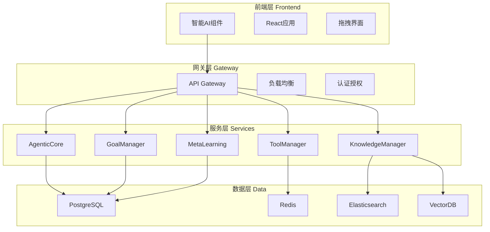

# YYC³ 智能插拔式移动AI系统 开发指南

## 📖 概述

本文档为YYC³智能插拔式移动AI系统的开发者指南，详细介绍如何参与项目开发、代码规范、架构设计等技术细节。

## 🏗️ 项目架构

### 整体架构

YYC³采用微服务架构，主要包含以下层次：



### 核心模块

| 模块 | 路径 | 功能 | 技术栈 |
|------|------|------|--------|
| **智能AI组件** | `components/ai-widget/` | 拖拽AI助手 | React + DnD |
| **核心引擎** | `services/core/` | 事件驱动架构 | TypeScript + Node.js |
| **工具管理** | `services/tools/` | 动态工具注册 | TypeScript |
| **知识库** | `services/knowledge/` | RAG检索 | VectorDB + Elasticsearch |
| **API网关** | `services/gateway/` | 统一入口 | Hono + Express |
| **服务编排** | `services/orchestrator/` | 微服务协调 | EventEmitter |

## 🛠️ 开发环境搭建

### 环境要求

- **Node.js**: >= 18.0.0
- **Bun**: >= 1.0.0
- **Docker**: >= 20.0.0
- **Docker Compose**: >= 2.0.0
- **Git**: >= 2.30.0

### 快速启动

1. **克隆项目**
   ```bash
   git clone https://github.com/yyc3/yyc3-xy-ai.git
   cd yyc3-xy-ai
   ```

2. **安装依赖**
   ```bash
   bun install
   ```

3. **配置环境变量**
   ```bash
   cp .env.example .env.local
   # 编辑 .env.local 文件
   ```

4. **启动开发服务器**
   ```bash
   bun run dev
   ```

5. **启动数据库服务**
   ```bash
   docker-compose up -d postgres redis elasticsearch
   ```

### 开发工具推荐

- **IDE**: VS Code + 相关插件
- **调试**: Chrome DevTools + Node.js Inspector
- **API测试**: Postman 或 Insomnia
- **数据库管理**: pgAdmin, Redis Desktop Manager
- **容器管理**: Docker Desktop

## 📁 项目结构详解

```
yyc3-xy-ai/
├── components/                 # React组件
│   ├── ai-widget/             # 智能AI组件
│   │   ├── IntelligentAIWidget.tsx    # 主组件
│   │   ├── IntelligentAIWidget.css    # 样式
│   │   └── types.ts                    # 类型定义
│   └── ai-xiaoyu/             # 小语AI助手
│       ├── EnhancedAIGirl.tsx          # 增强AI助手
│       └── components/                 # 子组件
├── services/                   # 后端服务
│   ├── core/                   # 核心引擎
│   │   └── AgenticCore.ts              # 自治核心引擎
│   ├── tools/                  # 工具管理
│   │   ├── ToolManager.ts              # 工具管理器
│   │   └── ToolRegistry.ts             # 工具注册表
│   ├── knowledge/              # 知识库
│   │   ├── KnowledgeManager.ts         # 知识管理器
│   │   └── VectorStore.ts              # 向量存储
│   ├── goals/                  # 目标管理
│   │   └── GoalManagementSystem.ts     # 目标管理系统
│   ├── learning/               # 学习系统
│   │   └── MetaLearningSystem.ts       # 元学习系统
│   ├── gateway/                # API网关
│   │   └── APIGateway.ts                # API网关实现
│   └── orchestrator/           # 服务编排
│       └── ServiceOrchestrator.ts      # 服务编排器
├── types/                      # TypeScript类型定义
│   ├── core/                   # 核心类型
│   ├── tools/                  # 工具类型
│   ├── knowledge/              # 知识库类型
│   ├── gateway/                # 网关类型
│   └── orchestrator/           # 编排类型
├── utils/                      # 工具函数
│   ├── logger.ts               # 日志工具
│   ├── validation.ts           # 验证工具
│   └── helpers.ts              # 辅助函数
├── hooks/                      # React Hooks
│   ├── useAIWidget.ts          # AI组件Hook
│   ├── useWebSocket.ts         # WebSocket Hook
│   └── useLocalStorage.ts       # 本地存储Hook
├── config/                     # 配置文件
│   ├── database.ts             # 数据库配置
│   ├── redis.ts                # Redis配置
│   └── ai.ts                   # AI服务配置
├── docs/                       # 文档
│   ├── API.md                  # API文档
│   ├── DEPLOYMENT.md           # 部署文档
│   └── ARCHITECTURE.md         # 架构文档
├── scripts/                    # 脚本文件
│   ├── build.sh                # 构建脚本
│   ├── deploy.sh               # 部署脚本
│   └── test.sh                 # 测试脚本
├── tests/                      # 测试文件
│   ├── unit/                   # 单元测试
│   ├── integration/            # 集成测试
│   └── e2e/                    # 端到端测试
├── main.ts                     # 应用入口
├── package.json                # 项目配置
├── tsconfig.json              # TypeScript配置
├── docker-compose.yml         # Docker编排
├── Dockerfile                  # Docker镜像
└── README.md                   # 项目说明
```

## 🎨 组件开发指南

### React组件规范

#### 1. 组件结构

```typescript
// components/example/ExampleComponent.tsx
import React, { useState, useEffect } from 'react';
import { cn } from '@/utils/helpers';

interface ExampleComponentProps {
  title: string;
  onAction?: (data: any) => void;
  className?: string;
  children?: React.ReactNode;
}

export const ExampleComponent: React.FC<ExampleComponentProps> = ({
  title,
  onAction,
  className,
  children
}) => {
  const [state, setState] = useState(initialState);

  useEffect(() => {
    // 组件挂载逻辑
  }, []);

  const handleClick = () => {
    onAction?.(state);
  };

  return (
    <div className={cn('example-component', className)}>
      <h2>{title}</h2>
      {children}
    </div>
  );
};

export default ExampleComponent;
```

#### 2. 自定义Hook

```typescript
// hooks/useExample.ts
import { useState, useCallback } from 'react';

interface UseExampleReturn {
  data: any;
  loading: boolean;
  error: string | null;
  fetchData: () => Promise<void>;
}

export const useExample = (initialData?: any): UseExampleReturn => {
  const [data, setData] = useState(initialData);
  const [loading, setLoading] = useState(false);
  const [error, setError] = useState<string | null>(null);

  const fetchData = useCallback(async () => {
    setLoading(true);
    setError(null);

    try {
      const response = await fetch('/api/example');
      const result = await response.json();
      setData(result);
    } catch (err) {
      setError(err instanceof Error ? err.message : 'Unknown error');
    } finally {
      setLoading(false);
    }
  }, []);

  return {
    data,
    loading,
    error,
    fetchData
  };
};
```

#### 3. 类型定义

```typescript
// types/example.ts
export interface ExampleData {
  id: string;
  name: string;
  createdAt: Date;
  updatedAt: Date;
}

export interface ExampleComponentProps {
  data: ExampleData;
  onUpdate: (data: Partial<ExampleData>) => void;
  variant?: 'default' | 'compact';
}

export type ExampleStatus = 'loading' | 'success' | 'error';
```

### AI组件开发

#### 创建新的AI工具

```typescript
// services/tools/new-tool.ts
import { Tool, ToolResult, ToolInput } from '@/types/tools';

export interface NewToolInput extends ToolInput {
  text: string;
  options?: {
    language?: string;
    format?: string;
  };
}

export class NewTool implements Tool {
  id = 'new-tool';
  name = '新工具';
  description = '这是一个新工具的描述';
  version = '1.0.0';
  category = 'utility';

  async validate(input: NewToolInput): Promise<boolean> {
    return !!input.text && input.text.length > 0;
  }

  async execute(input: NewToolInput): Promise<ToolResult> {
    try {
      // 工具执行逻辑
      const result = await this.processText(input.text, input.options);

      return {
        success: true,
        data: result,
        metadata: {
          processingTime: Date.now(),
          inputLength: input.text.length
        }
      };
    } catch (error) {
      return {
        success: false,
        error: error instanceof Error ? error.message : 'Unknown error',
        metadata: {
          inputLength: input.text?.length || 0
        }
      };
    }
  }

  private async processText(text: string, options?: any): Promise<any> {
    // 实际处理逻辑
    return { processedText: text, ...options };
  }
}
```

#### 注册工具

```typescript
// services/tools/index.ts
import { ToolManager } from './ToolManager';
import { NewTool } from './new-tool';

export const registerDefaultTools = async (toolManager: ToolManager) => {
  await toolManager.registerTool(new NewTool());
  // 注册其他工具...
};

export * from './new-tool';
```

## 🔧 服务端开发指南

### 核心服务开发

#### 1. 服务基类

```typescript
// services/base/BaseService.ts
import { EventEmitter } from 'events';

export abstract class BaseService extends EventEmitter {
  protected isInitialized = false;
  protected config: any;

  constructor(config?: any) {
    super();
    this.config = config || {};
  }

  abstract async initialize(): Promise<void>;
  abstract async shutdown(): Promise<void>;

  getStatus() {
    return {
      initialized: this.isInitialized,
      healthy: this.isInitialized
    };
  }

  protected emit(event: string, ...args: any[]): boolean {
    console.log(`[${this.constructor.name}] Event: ${event}`, args);
    return super.emit(event, ...args);
  }
}
```

#### 2. API路由定义

```typescript
// services/api/routes/example.ts
import { Hono } from 'hono';
import { zValidator } from '@hono/zod-validator';
import { z } from 'zod';

const app = new Hono();

const schema = z.object({
  message: z.string().min(1),
  options: z.object({
    priority: z.enum(['low', 'medium', 'high']).optional()
  }).optional()
});

app.post('/example', zValidator('json', schema), async (c) => {
  const { message, options } = c.req.valid('json');

  try {
    // 处理请求
    const result = await processMessage(message, options);

    return c.json({
      success: true,
      data: result
    });
  } catch (error) {
    return c.json({
      success: false,
      error: error instanceof Error ? error.message : 'Unknown error'
    }, 500);
  }
});

export default app;
```

#### 3. 数据库操作

```typescript
// services/database/repositories/ExampleRepository.ts
import { Pool } from 'pg';
import { ExampleData } from '@/types/example';

export class ExampleRepository {
  constructor(private pool: Pool) {}

  async create(data: Omit<ExampleData, 'id' | 'createdAt' | 'updatedAt'>): Promise<ExampleData> {
    const query = `
      INSERT INTO examples (name, description)
      VALUES ($1, $2)
      RETURNING *
    `;

    const values = [data.name, data.description];
    const result = await this.pool.query(query, values);

    return result.rows[0];
  }

  async findById(id: string): Promise<ExampleData | null> {
    const query = 'SELECT * FROM examples WHERE id = $1';
    const result = await this.pool.query(query, [id]);

    return result.rows[0] || null;
  }

  async update(id: string, data: Partial<ExampleData>): Promise<ExampleData | null> {
    const fields = Object.keys(data).filter(key => key !== 'id');
    const values = fields.map(field => data[field as keyof ExampleData]);

    if (fields.length === 0) return null;

    const setClause = fields.map((field, index) => `${field} = $${index + 2}`).join(', ');
    const query = `
      UPDATE examples
      SET ${setClause}, updated_at = CURRENT_TIMESTAMP
      WHERE id = $1
      RETURNING *
    `;

    const result = await this.pool.query(query, [id, ...values]);
    return result.rows[0] || null;
  }

  async delete(id: string): Promise<boolean> {
    const query = 'DELETE FROM examples WHERE id = $1';
    const result = await this.pool.query(query, [id]);
    return result.rowCount > 0;
  }
}
```

### 错误处理

```typescript
// utils/errors.ts
export class BaseError extends Error {
  constructor(
    message: string,
    public code: string,
    public statusCode: number = 500
  ) {
    super(message);
    this.name = this.constructor.name;
  }
}

export class ValidationError extends BaseError {
  constructor(message: string) {
    super(message, 'VALIDATION_ERROR', 400);
  }
}

export class NotFoundError extends BaseError {
  constructor(resource: string) {
    super(`${resource} not found`, 'NOT_FOUND', 404);
  }
}

export class UnauthorizedError extends BaseError {
  constructor(message: string = 'Unauthorized') {
    super(message, 'UNAUTHORIZED', 401);
  }
}

// 错误处理中间件
export const errorHandler = (error: Error, c: any) => {
  console.error('Error:', error);

  if (error instanceof BaseError) {
    return c.json({
      success: false,
      error: {
        code: error.code,
        message: error.message
      }
    }, error.statusCode);
  }

  return c.json({
    success: false,
    error: {
      code: 'INTERNAL_ERROR',
      message: 'Internal server error'
    }
  }, 500);
};
```

## 🧪 测试指南

### 单元测试

```typescript
// tests/unit/services/tools/NewTool.test.ts
import { describe, it, expect, beforeEach } from 'bun:test';
import { NewTool } from '@/services/tools/NewTool';

describe('NewTool', () => {
  let tool: NewTool;

  beforeEach(() => {
    tool = new NewTool();
  });

  it('should validate input correctly', async () => {
    const validInput = { text: 'Hello World' };
    expect(await tool.validate(validInput)).toBe(true);

    const invalidInput = { text: '' };
    expect(await tool.validate(invalidInput)).toBe(false);
  });

  it('should execute successfully with valid input', async () => {
    const input = { text: 'Hello World' };
    const result = await tool.execute(input);

    expect(result.success).toBe(true);
    expect(result.data).toBeDefined();
    expect(result.metadata).toBeDefined();
  });

  it('should handle errors gracefully', async () => {
    const input = { text: '' }; // This will cause validation to fail
    const result = await tool.execute(input);

    expect(result.success).toBe(false);
    expect(result.error).toBeDefined();
  });
});
```

### 集成测试

```typescript
// tests/integration/api/chat.test.ts
import { describe, it, expect, beforeAll, afterAll } from 'bun:test';
import { app } from '@/main';

describe('Chat API', () => {
  let server: any;

  beforeAll(async () => {
    server = app.listen({ port: 0 });
  });

  afterAll(async () => {
    server.close();
  });

  it('should handle chat requests', async () => {
    const response = await fetch(`http://localhost:${server.port}/api/ai/chat`, {
      method: 'POST',
      headers: {
        'Content-Type': 'application/json',
        'Authorization': 'Bearer test-token'
      },
      body: JSON.stringify({
        message: 'Hello AI',
        mode: 'chat'
      })
    });

    expect(response.status).toBe(200);
    const data = await response.json();
    expect(data.success).toBe(true);
    expect(data.data.message).toBeDefined();
  });
});
```

### E2E测试

```typescript
// tests/e2e/ai-widget.test.ts
import { describe, it, expect } from 'bun:test';
import { chromium, Browser, Page } from 'playwright';

describe('AI Widget E2E', () => {
  let browser: Browser;
  let page: Page;

  beforeAll(async () => {
    browser = await chromium.launch();
    page = await browser.newPage();
  });

  afterAll(async () => {
    await browser.close();
  });

  it('should load and display AI widget', async () => {
    await page.goto('http://localhost:3000');

    // 检查AI组件是否加载
    const widget = await page.waitForSelector('[data-testid="ai-widget"]');
    expect(widget).toBeTruthy();
  });

  it('should handle user input and AI response', async () => {
    await page.goto('http://localhost:3000');

    // 输入消息
    await page.fill('[data-testid="message-input"]', 'Hello AI');
    await page.click('[data-testid="send-button"]');

    // 等待AI回复
    const response = await page.waitForSelector('[data-testid="ai-response"]');
    expect(response).toBeTruthy();

    // 验证回复内容
    const responseText = await response.textContent();
    expect(responseText?.length).toBeGreaterThan(0);
  });
});
```

## 📝 代码规范

### TypeScript规范

1. **类型定义优先**
   ```typescript
   // 优先使用interface
   interface User {
     id: string;
     name: string;
   }

   // 避免any类型
   const processData = (data: unknown) => {
     // 类型守卫
     if (typeof data === 'string') {
       return data.toUpperCase();
     }
     throw new Error('Invalid data type');
   };
   ```

2. **严格模式配置**
   ```json
   // tsconfig.json
   {
     "compilerOptions": {
       "strict": true,
       "noImplicitAny": true,
       "noImplicitReturns": true,
       "noUnusedLocals": true
     }
   }
   ```

### React组件规范

1. **函数组件优先**
2. **Props接口定义**
3. **默认值和类型**
4. **性能优化**

```typescript
interface ComponentProps {
  title: string;
  count?: number;
  onAction: (data: any) => void;
}

const Component: React.FC<ComponentProps> = ({
  title,
  count = 0,
  onAction
}) => {
  const handleClick = useCallback(() => {
    onAction({ title, count });
  }, [title, count, onAction]);

  return (
    <div>
      <h1>{title}</h1>
      <button onClick={handleClick}>Action</button>
    </div>
  );
};
```

### 代码格式化

```json
// .prettierrc
{
  "semi": true,
  "trailingComma": "es5",
  "singleQuote": true,
  "printWidth": 80,
  "tabWidth": 2,
  "useTabs": false
}
```

```json
// .eslintrc.json
{
  "extends": [
    "@typescript-eslint/recommended",
    "prettier"
  ],
  "rules": {
    "@typescript-eslint/no-unused-vars": "error",
    "@typescript-eslint/explicit-function-return-type": "warn"
  }
}
```

## 🚀 部署和发布

### 构建流程

```bash
# 类型检查
bun run type-check

# 代码检查
bun run lint

# 运行测试
bun run test

# 构建应用
bun run build

# 启动生产服务
bun run start
```

### Docker部署

```dockerfile
# 多阶段构建
FROM node:20-alpine AS builder
WORKDIR /app
COPY package*.json ./
RUN bun install --frozen-lockfile
COPY . .
RUN bun run build

FROM node:20-alpine AS production
WORKDIR /app
COPY --from=builder /app/dist ./dist
COPY package*.json ./
RUN bun install --production --frozen-lockfile
EXPOSE 8080
CMD ["bun", "run", "start"]
```

## 🔍 调试技巧

### 服务端调试

```typescript
// 使用调试器
const debugger = require('debug')('app:service');

class ExampleService {
  async process(data: any) {
    debugger('Processing data: %O', data);

    try {
      const result = await this.doProcess(data);
      debugger('Process result: %O', result);
      return result;
    } catch (error) {
      debugger('Process error: %O', error);
      throw error;
    }
  }
}

// 启用调试
DEBUG=app:* bun run dev
```

### 前端调试

```typescript
// React DevTools
import { useEffect } from 'react';

useEffect(() => {
  if (process.env.NODE_ENV === 'development') {
    window.__APP_DEVTOOLS__ = true;
  }
}, []);

// 性能监控
const measurePerformance = (name: string, fn: () => void) => {
  const start = performance.now();
  fn();
  const end = performance.now();
  console.log(`${name} took ${end - start} milliseconds`);
};
```

## 📚 学习资源

### 推荐阅读

- [TypeScript Handbook](https://www.typescriptlang.org/docs/)
- [React Documentation](https://react.dev/)
- [Node.js Best Practices](https://github.com/goldbergyoni/nodebestpractices)
- [Microservices Patterns](https://microservices.io/patterns/)

### 相关工具

- **API测试**: Postman, Insomnia
- **数据库管理**: pgAdmin, Redis Desktop Manager
- **容器管理**: Docker Desktop, Portainer
- **监控工具**: Grafana, Kibana

## 🤝 贡献流程

1. Fork项目
2. 创建功能分支
3. 编写代码和测试
4. 提交Pull Request
5. 代码审查
6. 合并到主分支

详细的贡献指南请参考 [CONTRIBUTING.md](CONTRIBUTING.md)。

---

最后更新: 2024-01-01
---

<div align="center">

> 「***YanYuCloudCube***」
> 「***<admin@0379.email>***」
> 「***Words Initiate Quadrants, Language Serves as Core for the Future***」
> 「***All things converge in the cloud pivot; Deep stacks ignite a new era of intelligence***」

</div>

